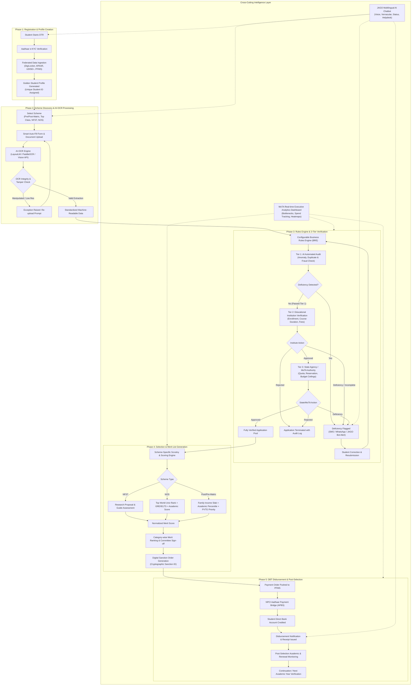
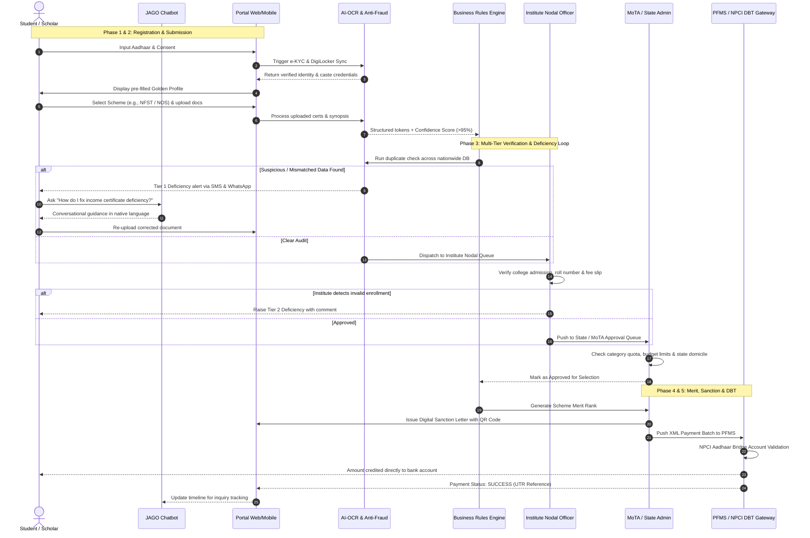
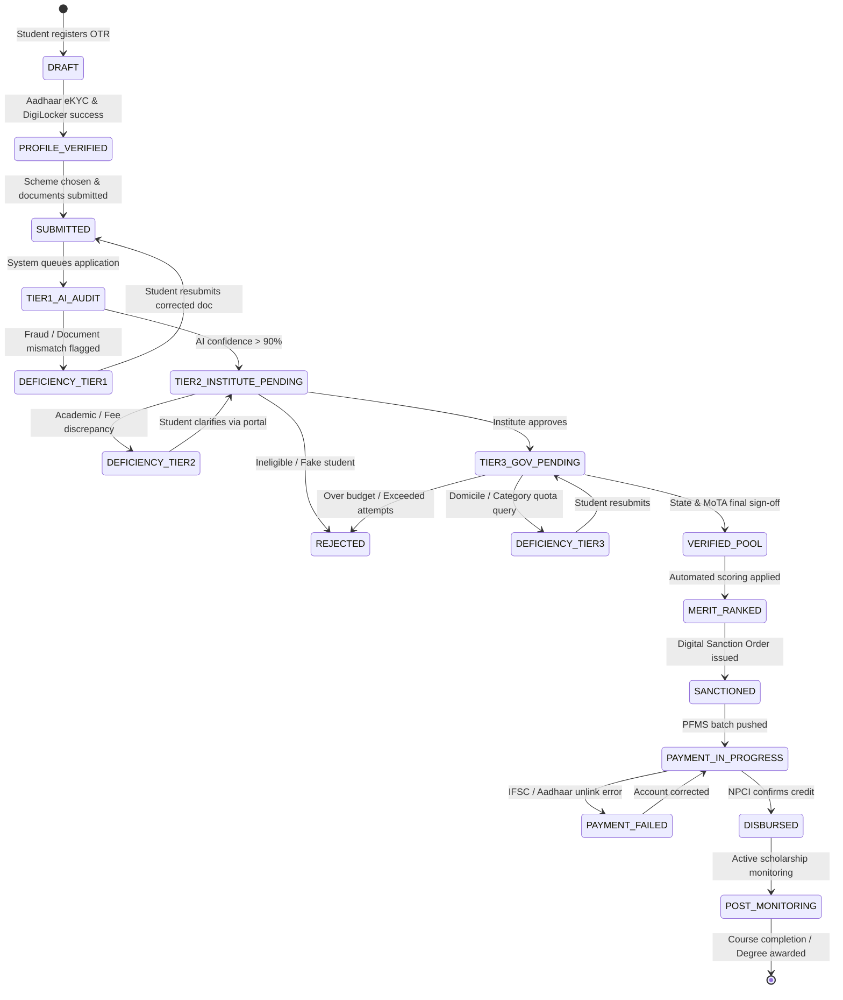

# SIH-PS-26239: AI-Enabled Scholarship & Fellowship Management System
## End-to-End Project Workflow & Architectural Blueprint
**Ministry of Tribal Affairs (MoTA), Government of India**

---


---

## 1. Executive Workflow Summary

The system orchestrates a 9-stage unified digital lifecycle:
$$\text{REGISTER} \longrightarrow \text{VERIFY} \longrightarrow \text{APPLY} \longrightarrow \text{AI/OCR PROCESS} \longrightarrow \text{VALIDATE} \longrightarrow \text{SELECT} \longrightarrow \text{SANCTION} \longrightarrow \text{DISBURSE} \longrightarrow \text{MONITOR}$$

It eliminates repetitive physical documentation, automates fraud and eligibility scrutiny via OCR & configurable rules, coordinates a 3-tier verification hierarchy, generates automated merit lists, triggers Direct Benefit Transfer (DBT) via PFMS/NPCI, and supports students 24/7 via the **JAGO Multilingual AI Chatbot**.

---

## 2. Master End-to-End System Flowchart

The following diagram maps the entire macro journey of a student application, showing happy paths, anomaly branches, deficiency re-entry loops, and post-selection operations.



---

## 3. Swimlane Sequence Diagram: Role-Based Workflow

This interaction flow details the sequence of calls between actors across the verification, audit, and payment stages.



---

## 4. Application Lifecycle State Machine

Each application advances through deterministic states with clear transition triggers and rollback capabilities:



---

## 5. Detailed Phase-by-Phase Technical Blueprint

### Phase 1: One-Time Registration (OTR) & Golden Profile Creation
* **Primary Objective**: Eliminate redundant paperwork by creating a persistent, verified digital identity.
* **Integrations**:
  1. **Aadhaar e-KYC**: Real-time demographic verification (UIDAI OTP/Biometric).
  2. **DigiLocker**: Automated retrieval of Caste (ST/PVTG) certificates, Class 10/12 marksheets, and Domicile certificates directly from state issuers.
  3. **APAAR / ABC (Academic Bank of Credits)**: Automated academic history fetch.
  4. **UDISE+**: School verification for Pre-Matric candidates.
  5. **PFMS / NPCI APBS**: Bank account validation checking whether account is active and seeded with Aadhaar.
* **Output**: **Unique Student ID** (e.g., `MOTA-2026-ST-092817`) with an immutable verified credential store.

---

### Phase 2: Smart Application & AI-OCR Document Processing
* **Supported Schemes**:
  * *Pre-Matric Scholarship for ST Students* (Classes IX & X)
  * *Post-Matric Scholarship for ST Students* (Class XI to Post-Graduation)
  * *Top Class Education Scheme for ST Students* (Premier institutes like IITs, IIMs, NITs)
  * *National Fellowship for Higher Education of ST Students (NFST)* (M.Phil / Ph.D. scholars)
  * *National Overseas Scholarship for ST Candidates (NOS)* (Master's / Ph.D. abroad)
* **Smart Auto-Fill**:
  When a student chooses a scheme, $80\%$ of fields are pre-populated from the Golden Profile.
* **AI-OCR Pipeline**:
  ```
  Uploaded PDF/Image 
       ↓ 
  Image Pre-processing (Deskew, Denoise, Contrast Enhancement)
       ↓ 
  OCR Engine (PaddleOCR / Tesseract 5 / TrOCR)
       ↓ 
  Layout & Entity Extraction (LayoutLMv3 / Donut / NER)
       ↓ 
  Confidence Scoring & Tamper Check (EXIF analysis, ELA, Digital Signature)
       ↓ 
  Structured JSON Tokenization
  ```
* **Validation Rules**:
  * Name phonetic match (Levenshtein distance $\le 2$ or Jaro-Winkler score $\ge 0.92$).
  * ST/PVTG certificate issuing authority validation via state repository hashes.
  * Institution accreditation validation via AISHE / NIRF code database.

---

### Phase 3: Configurable Rules Engine & 3-Tier Verification
* **Business Rules Engine (BRE)**:
  Implemented using a declarative decision engine (e.g., JSON Rules Engine / Drools / Celery workflow):
  * **Income Ceiling**: e.g., $\le ₹2.5\text{ Lakhs/year}$ for Post-Matric; $\le ₹6.0\text{ Lakhs}$ for Top Class; $\le ₹8.0\text{ Lakhs}$ for NOS.
  * **Academic Eligibility**: Minimum percentage criteria or qualifying exam percentiles.
  * **Scheme Exclusivity**: Checking against NSP to prevent double-dipping across ministries.
* **The 3-Tier Verification Hierarchy**:
  1. **Tier 1 – AI Audit**: Immediate instant check for missing fields, expired certificates, fuzzy name mismatches, duplicate documents across any sibling/parent records, and synthetic identity markers.
  2. **Tier 2 – Educational Institution (INO Queue)**: College Nodal Officer verifies admission register number, physical attendance/enrollment, course duration, and actual tuition/hostel fee structure.
  3. **Tier 3 – State Agency / MoTA Officer (SNO Queue)**: Final statutory review verifying state tribal quotas, special PVTG reservations, and financial sanction ceilings.
* **Deficiency & Resubmission Feedback Loop**:
  * If any tier flags a missing or ambiguous document, status becomes `DEFICIENCY_RAISED`.
  * Multi-channel alert triggered: SMS, WhatsApp alert, and banner notification in student dashboard.
  * The student sees exactly which field/page is defective with highlighted instructions.
  * Resubmitted docs bypass initial steps and return directly to the tier that requested the correction.

---

### Phase 4: Selection & Merit List Generation
Different schemes utilize specific mathematical selection criteria:

| Scheme | Evaluation Criteria | Selection Logic |
| :--- | :--- | :--- |
| **NFST (Fellowship)** | Research proposal quality, guide credentials, UGC-NET/GATE score | Weighted Index = $0.4(\text{Proposal}) + 0.3(\text{NET Score}) + 0.3(\text{PG Marks})$ |
| **NOS (Overseas)** | Foreign University QS Rank, GRE/IELTS band, Academic merit | Tiered by QS World Top 500 Ranking + Category Quota |
| **Top Class** | Admission in notified premier institute (IIT/IIM/AIIMS) | 100% course fee + living allowance up to annual ceiling |
| **Post-Matric / Pre-Matric** | Need-cum-merit: Income slab + Previous year grade + PVTG priority | Sorted by lowest family income first, breaking ties by academic score |

* **Digital Sanction Process**:
  * Selection Committee approves digitally through e-Sign / Digital Signature Certificate (DSC).
  * System generates a tamper-evident **Digital Sanction Order** with a verifiable QR code, allocated amount, academic duration, and unique Sanction ID.

---

### Phase 5: DBT Payment Processing & Post-Selection Monitoring
* **Disbursement Architecture**:
  $$\text{Sanction Order} \xrightarrow{\text{Batch XML/API}} \text{PFMS} \xrightarrow{\text{Aadhaar Bridge}} \text{NPCI} \xrightarrow{\text{APBS Direct Credit}} \text{Student Bank Account}$$
* **Payment Lifecycle States**:
  * `SANCTIONED` $\rightarrow$ `PAYMENT_INITIATED` $\rightarrow$ `PFMS_VALIDATED` $\rightarrow$ `APBS_PROCESSING` $\rightarrow$ `DISBURSED (UTR)`
  * *Failure Recovery*: If payment bounces due to Aadhaar de-linking or inactive KYC, an automatic notification alerts the student with actionable bank rectification steps.
* **Post-Selection & Renewal Monitoring**:
  * Bi-annual academic progress tracker (semester marksheet upload via DigiLocker).
  * Institution attendance verification token.
  * Fellowship progress reports uploaded by research guide for subsequent tranche releases.

---

## 6. Cross-Cutting Systems

### A. JAGO Multilingual AI Chatbot
* **Accessibility**: Supports Hindi, English, Santhali, Gondi, Odia, Bengali, Telugu, Marathi, and other regional languages.
* **Modalities**: Text, Voice-to-Text, and Text-to-Speech (utilizing Bhashini AI engine).
* **Capabilities**:
  * Scheme recommendation based on student qualification and tribe.
  * Real-time application tracking ("Where is my application stuck?").
  * Step-by-step guidance on resolving specific deficiency notifications.
  * Automated payment receipt lookup and grievance logging.

### B. Anti-Fraud & Anomaly Detection System
* **Document Hash Matching**: SHA-256 hash checks on uploaded PDFs to detect reused certificates across multiple profiles.
* **Metadata & ELA Forensics**: Error Level Analysis (ELA) to detect Photoshop edits on income figures or dates.
* **Cross-Scheme Duplicate Prevention**: Real-time cross-referencing with NSP (National Scholarship Portal) and state scholarship databases to prevent multiple simultaneous claims.
* **Geographical & Institution Anomaly Detector**: Flags high concentrations of applications from non-existent or un-accredited private coaching centers claiming institutional fees.

### C. MoTA Executive Analytics Dashboard
* **Macro KPIs**: Total applications, verification velocity, average turnaround time (TAT) per tier, total disbursed funds, pending deficiency clearance rate.
* **Drilldown Capabilities**:
  * State-wise and District-wise tribal coverage heatmaps.
  * PVTG (Particularly Vulnerable Tribal Groups) saturation metrics.
  * Institution-level bottleneck detection (identifying colleges lagging in Tier-2 approvals).

---

## 7. Recommended Technology Stack for Hackathon Prototype

```
┌────────────────────────────────────────────────────────┐
│                        FRONTEND                        │
│   React.js / Next.js 14 + Tailwind CSS + PWA Support   │
│       Accessible (WCAG 2.1 AA) + Multilingual UI       │
└──────────────────────────┬─────────────────────────────┘
                           │ REST / GraphQL APIs
┌──────────────────────────▼─────────────────────────────┐
│                    APPLICATION BACKEND                 │
│      Python (FastAPI) / Node.js (NestJS) + Redis       │
│      JWT Auth + Role-Based Access Control (RBAC)       │
└──────┬───────────────────┬───────────────────┬─────────┘
       │                   │                   │
┌──────▼──────┐     ┌──────▼──────┐     ┌──────▼──────┐
│  AI / OCR   │     │RULES ENGINE │     │ JAGO BOT    │
│  PaddleOCR  │     │ Python Rule │     │ LangChain   │
│  OpenCV     │     │ Engine /    │     │ Bhashini    │
│  HuggingFace│     │ Celery Flow │     │ RAG VectorDB│
└─────────────┘     └─────────────┘     └─────────────┘
       │                   │                   │
┌──────▼───────────────────▼───────────────────▼─────────┐
│                    DATABASE & STORAGE                  │
│   PostgreSQL (Transactional) + MinIO / S3 (Encrypted)  │
│         Milvus / ChromaDB (Vector Search for RAG)      │
└────────────────────────────────────────────────────────┘
```
